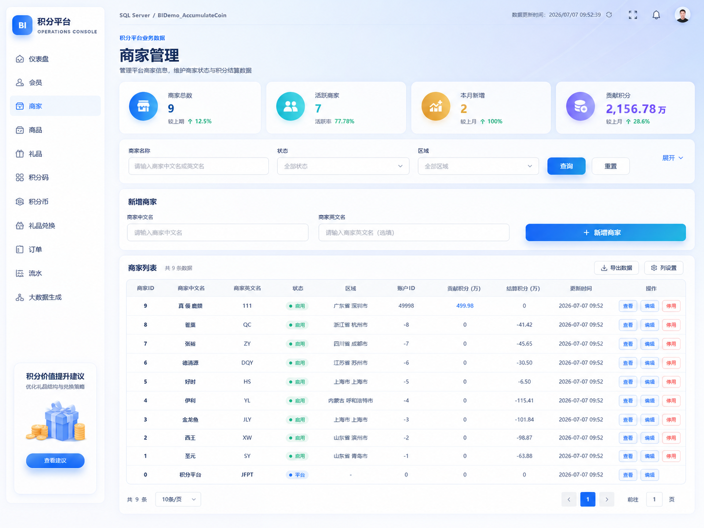
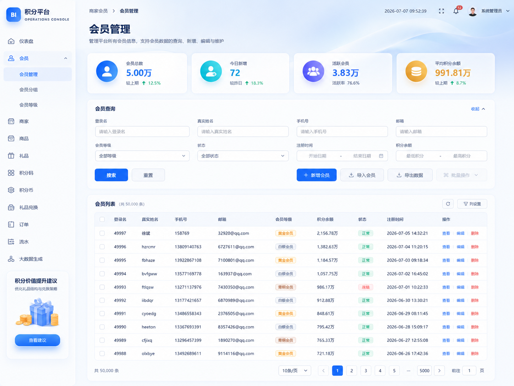
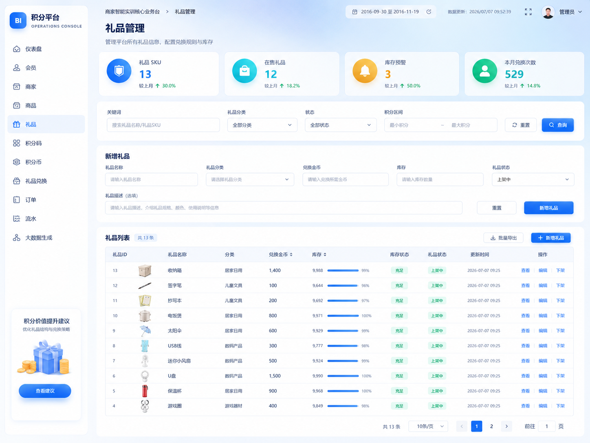
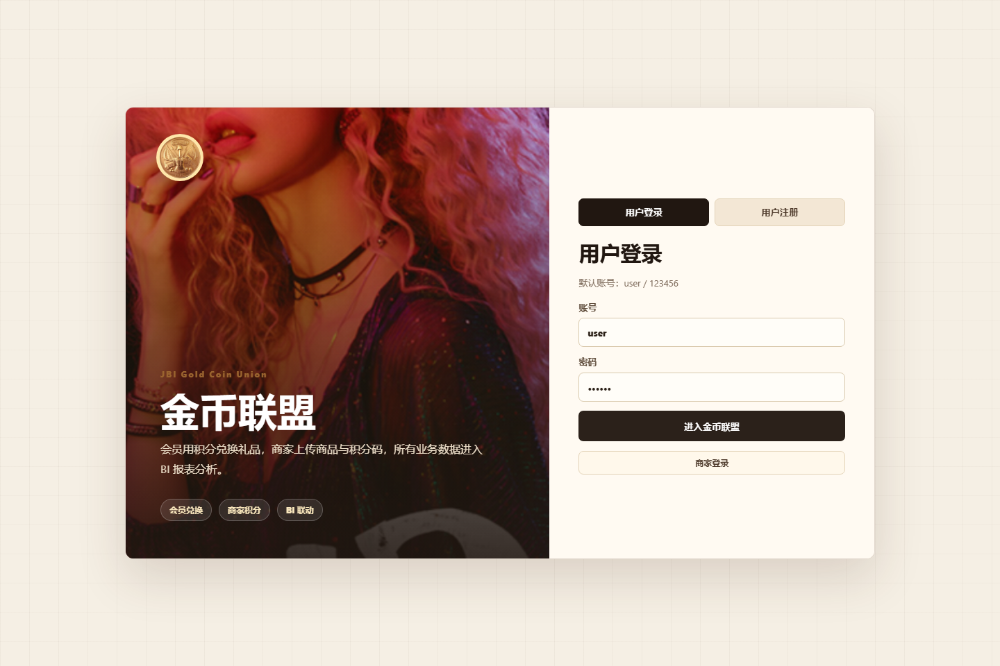
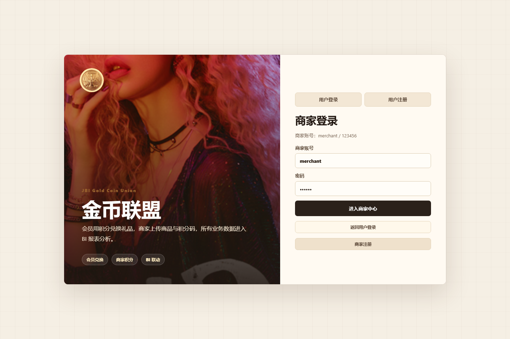
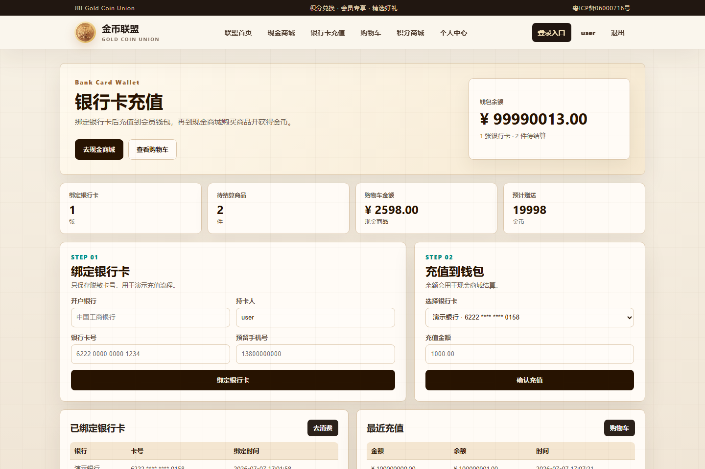
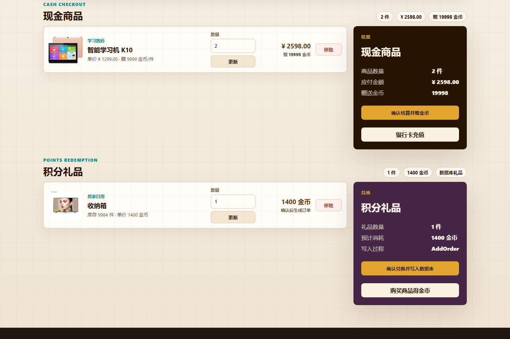
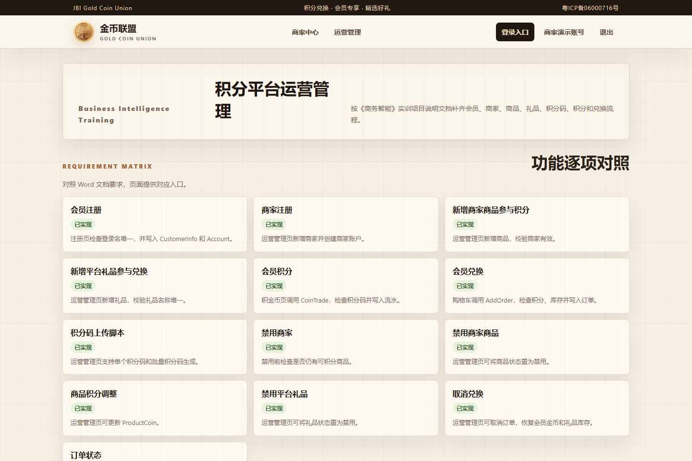

# BI 实训项目说明

本目录包含两个围绕“积分兑换平台”的 Flask 项目：

1. `金币联盟`：会员前台商城，负责会员注册登录、银行卡充值、现金购物赠金币、积分商城兑换、商家商品和积分码管理。
2. `报表BI`：后台管理和 BI 分析系统，负责业务数据维护、数据仓库建模、ETL 抽取、Dashboard 视图和 ECharts 可视化大屏。

两个项目共用业务库 `BIDemo_AccumulateCoin`。`金币联盟` 产生业务数据，`报表BI` 将业务数据抽取到 `BI_GoldCoin_DW` 后进行统计分析，形成“业务操作 → 业务库 → 数据仓库 → BI 大屏”的完整实训闭环。

## 一、项目结构

```text
BI/
├─ 报表BI/        后台管理 + 数据仓库 + ETL + BI 报表大屏
├─ 金币联盟/      会员前台商城复刻系统
└─ img/           README 演示截图
```

## 二、报表BI

`报表BI` 是积分兑换平台的 BI 报表项目，使用 `Flask + SQL Server + ECharts` 实现。项目不只是展示图表，还包含业务数据维护、数据仓库 SQL、ETL 脚本、Dashboard 统计视图和可视化大屏。


### 主要功能

- 会员、商家、商品、礼品、积分码、订单、积分流水等后台管理页面。
- 积分获取和礼品兑换业务操作页面。
- 数据仓库 `BI_GoldCoin_DW` 建库脚本。
- ODS、维度表、事实表和 Dashboard 视图脚本。
- 全量 ETL 和增量 ETL 脚本。
- ECharts 单页 BI 仪表盘。
- BI API 接口，为前端图表提供数据。

### 页面截图

商家管理：



会员管理：



礼品管理：


### 分析主题

项目覆盖以下 BI 分析主题：

| 主题 | 说明 |
|---|---|
| 商家统计分析 | 查看商家数量、商品数量和商家贡献 |
| 会员统计分析 | 查看会员规模、会员增长和地域分布 |
| 礼品统计分析 | 查看礼品库存、兑换次数和兑换金币 |
| 订单统计分析 | 查看订单趋势、订单积分和订单状态 |
| 商家会员统计分析 | 查看商家带来的会员和积分贡献 |
| 商品积分统计分析 | 查看商品积分码和积分贡献 |
| 积分码使用统计分析 | 查看积分码待使用、已使用和无效状态 |
| 积分流水统计分析 | 查看金币收入、金币支出和账户交易 |
| 地域统计分析 | 查看不同地区会员和订单分布 |

### 技术方案

| 类型 | 内容 |
|---|---|
| Web 框架 | Flask |
| 页面模板 | Jinja2 |
| 图表 | ECharts |
| 数据库 | SQL Server |
| 业务库 | `BIDemo_AccumulateCoin` |
| 数据仓库 | `BI_GoldCoin_DW` |
| 数据库连接 | pyodbc |

### 运行方式

```powershell
cd C:\Users\PXHONY\Desktop\BI\报表BI
pip install -r requirements.txt
python app.py
```

如果使用本机 Python 3.10 路径：

```powershell
& 'C:\Users\PXHONY\AppData\Local\Programs\Python\Python310\python.exe' app.py
```

启动后访问：

```text
http://127.0.0.1:5101
```

### 数据仓库初始化

数据仓库脚本位于：

```text
报表BI/sql/dw/
```

首次初始化建议按顺序执行：

```powershell
sqlcmd -S . -E -C -i sql\dw\01_create_dw_database.sql
sqlcmd -S . -E -C -d BI_GoldCoin_DW -i sql\dw\02_create_ods_tables.sql
sqlcmd -S . -E -C -d BI_GoldCoin_DW -i sql\dw\03_create_dim_tables.sql
sqlcmd -S . -E -C -d BI_GoldCoin_DW -i sql\dw\04_create_fact_tables.sql
sqlcmd -S . -E -C -d BI_GoldCoin_DW -i sql\dw\05_full_etl.sql
sqlcmd -S . -E -C -d BI_GoldCoin_DW -i sql\dw\07_dashboard_views.sql
```

后续同步新增业务数据：

```powershell
sqlcmd -S . -E -C -d BI_GoldCoin_DW -i sql\dw\06_incremental_etl.sql
```

## 三、金币联盟

`金币联盟` 是会员前台商城和商家端复刻系统，基于原 ASP.NET Web Forms 版本的金币联盟页面和图片素材，使用 `Flask + HTML + CSS + SQL Server` 重新实现。它既面向会员使用，也补充了商家登录、商家注册、商品维护、商品积分调整、积分码上传和运营管理等实训功能。

这个项目和 `报表BI` 共用业务库 `BIDemo_AccumulateCoin`。会员在金币联盟中产生的注册、积分码使用、现金购物赠金币、礼品兑换、订单和积分流水数据，后续都可以被 `报表BI` 抽取到数据仓库中做统计分析。

### 主要功能

- 精美登录注册入口，默认用户登录，并提供商家登录/注册切换。
- 用户端金币联盟首页展示。
- 原金币联盟 Logo、横幅、商品图片和频道图片素材复用。
- 会员注册。
- 会员登录和退出。
- 银行卡绑定和钱包充值。
- 现金商城加入购物车，统一结算后扣减钱包余额并赠送金币。
- 积分商城加入兑换车，确认兑换后调用原系统 `AddOrder` 写入订单。
- 商家注册，包含商家名称、登录账号、联系人、电话、邮箱、地址、经营类目、执照号等资料。
- 商家登录。
- 商家商品图片化管理，支持新增、查询、编辑、禁用/删除和积分调整。
- 商家积分码单个上传和批量生成。
- 输入积分码获取金币。
- 个人中心查看会员信息、订单和积分流水。

### 页面路由

| 路由 | 功能 |
|---|---|
| `/` | 登录注册入口，默认用户登录，也支持商家登录和商家注册 |
| `/mall` | 用户登录后的金币联盟首页 |
| `/login` | 会员登录 |
| `/register` | 会员注册 |
| `/earn-coin` | 输入积分码获取金币 |
| `/wallet` | 银行卡绑定、钱包充值、充值记录 |
| `/shop` | 现金商城，浏览现金商品并加入购物车，提交后进入 `/cart#cash-cart` |
| `/cart` | 统一购物车，处理现金商品结算和积分礼品兑换 |
| `/points-mall` | 积分商城，浏览数据库礼品并加入兑换车，提交后进入 `/cart#points-cart` |
| `/profile` | 个人中心 |
| `/merchant` | 商家中心，图片化商品 CRUD、积分调整和积分码管理 |
| `/admin-lite` | 运营管理，覆盖实训后台操作 |
| `/profile/complete` | 完善个人信息 |
| `/profile/edit` | 修改个人信息 |
| `/logout` | 退出登录 |

### 核心功能与页面截图

下面是 `金币联盟` 当前系统的核心功能说明和对应页面截图，图片统一存放在 `BI/img/` 目录下。

#### 1. 统一登录和角色入口

系统入口页集中处理用户登录、用户注册、商家登录和商家注册。默认用户账号为 `user / 123456`，默认商家账号为 `merchant / 123456`，便于实训演示时快速切换不同角色。



#### 2. 商家登录

商家可以从入口页切换到商家登录模式，登录后进入商家中心，维护商品、商品积分和积分码。



#### 3. 商家注册

商家注册表单会收集商家名称、登录账号、密码、经营类目、联系人、联系电话、邮箱、营业执照号、商家地址和备注。提交后系统会创建商家资料和商家积分账户。


#### 4. 会员商城首页

会员登录后进入金币联盟首页，页面保留原金币联盟 Logo、横幅、商品九宫格和频道素材，作为会员端商城的主入口。


#### 5. 钱包、银行卡和充值

钱包页负责银行卡绑定、钱包充值、充值记录和待结算状态展示。现金商城购买商品时会从钱包余额中扣款，并按商品规则赠送金币。



#### 6. 现金商城和购物车

现金商城展示商品图片、价格、可赠送金币和数量输入。会员点击加入购物车后跳转到 `/cart#cash-cart`，直接看到待结算商品。


#### 7. 统一购物车

购物车页分为现金商品结算和积分礼品兑换两块。现金商品结算会扣减钱包余额并增加金币；积分礼品兑换会调用 `AddOrder` 写入订单和订单礼品数据。



#### 8. 积分商城兑换

积分商城从 `GiftInfo` 表读取礼品、库存和所需金币。用户先加入兑换车，再到购物车确认兑换，避免提交后停留在商品列表造成无反馈感。


#### 9. 输入积分码获取金币

会员在积金币页面输入积分码，系统调用 `CoinTrade` 存储过程，检查积分码有效性，更新积分码状态，并写入积分流水。


#### 10. 个人中心

个人中心汇总会员资料、金币账户、钱包余额、银行卡、现金订单、兑换订单和积分流水，便于查看会员侧完整业务记录。


#### 11. 商家中心

商家中心支持商品图片化管理、商品新增、查询、编辑、禁用/删除、商品积分调整、积分码单个上传和批量生成。


#### 12. 运营管理

运营管理页补齐后台业务能力，覆盖商家、商品、礼品、积分码、订单取消和订单完成等实训要求。



#### 13. 业务数据到 BI 分析

金币联盟产生的会员、商家、商品、积分码、现金购物、礼品兑换、订单和积分流水数据，会沉淀到 `BIDemo_AccumulateCoin` 业务库或本地演示数据文件。`报表BI` 再通过 ETL 把数据抽取到 `BI_GoldCoin_DW` 数据仓库，最终在 ECharts BI 大屏中分析会员、商家、订单、礼品、积分码和金币流水。

```text
金币联盟业务操作
        ↓
BIDemo_AccumulateCoin 业务库
        ↓
报表BI 执行 ETL
        ↓
BI_GoldCoin_DW 数据仓库
        ↓
ECharts BI 大屏分析
```

### 技术方案

| 类型 | 内容 |
|---|---|
| Web 框架 | Flask |
| 页面模板 | Jinja2 |
| 样式 | CSS |
| 交互 | 原生 JavaScript |
| 数据库 | SQL Server |
| 业务库 | `BIDemo_AccumulateCoin` |
| 数据库连接 | pyodbc |

### 运行方式

```powershell
cd C:\Users\PXHONY\Desktop\BI\金币联盟
pip install -r requirements.txt
python app.py
```

如果使用本机 Python 3.10 路径：

```powershell
& 'C:\Users\PXHONY\AppData\Local\Programs\Python\Python310\python.exe' app.py
```

启动后访问：

```text
http://127.0.0.1:5102
```

演示账号：

| 角色 | 账号 | 密码 |
|---|---|---|
| 用户 | `user` | `123456` |
| 商家 | `merchant` | `123456` |

## 四、两个项目的关系

```text
金币联盟
  会员注册、银行卡充值、现金购物赠金币、商家注册、商品积分、积分码、礼品兑换、订单
        ↓
BIDemo_AccumulateCoin 业务库
        ↓
报表BI ETL
        ↓
BI_GoldCoin_DW 数据仓库
        ↓
报表BI 大屏展示
```

`金币联盟` 更偏会员前台操作，负责产生真实业务数据；`报表BI` 更偏后台管理和分析展示，负责整理业务数据、建设数据仓库并输出可视化报表。两个项目组合后，可以形成从会员使用、业务数据沉淀、数据仓库建模到 BI 报表分析的完整闭环。

### 4.1 数据交互闭环

两个项目不是孤立运行，而是通过同一个业务库和数据仓库形成交互：

| 在金币联盟中的操作 | 写入/影响的业务数据 | 在报表BI中的体现 |
|---|---|---|
| 会员注册 | `CustomerInfo`、`Account` | 会员数量、会员增长趋势、会员地域分析 |
| 商家注册 | `BusinessMen`、商家账户 `Account` | 商家数量、商家会员贡献分析 |
| 新增商家商品 | `ProductInfo` | 商品数量、商品积分贡献排行 |
| 上传/批量生成积分码 | `JFCode` | 积分码状态统计、商品积分码贡献 |
| 会员输入积分码积金币 | `JFCode` 状态、`AccountTradeLog`、账户金币 | 金币收入、积分流水、商品/商家贡献 |
| 会员现金购物赠金币 | `Account`、金币联盟本地钱包记录 | 会员金币余额变化，可作为现金订单扩展数据 |
| 会员兑换礼品 | `OrderInfo`、`OrderGift`、`AccountTradeLog`、礼品库存 | 订单趋势、礼品兑换排行、金币支出 |
| 取消兑换或完成订单 | `OrderInfo` 状态、账户/库存变化 | 订单状态、订单数、兑换积分变化 |

交互演示时，先在 `金币联盟` 执行业务操作，再到 `报表BI` 执行增量 ETL，最后刷新 BI 大屏即可看到统计结果变化。

## 五、当前前端与购物车优化

`金币联盟` 最近对会员侧核心页面做了统一优化：

| 页面 | 优化内容 |
|---|---|
| `/wallet` | 重做银行卡充值页，增加钱包余额、绑定银行卡数、待结算商品、购物车金额和预计赠送金币等状态卡 |
| `/shop` | 重做现金商城商品卡，页面顶部直接展示购物车件数、金额和预计赠送金币 |
| `/points-mall` | 重做积分商城礼品卡，页面顶部展示兑换车数量、预计消耗金币和数据库写入方式 |
| `/cart` | 重做购物车布局，将现金商品结算和积分礼品兑换拆成两块，分别显示数量、金额、金币和确认按钮 |

现金商品点击“加入购物车”后会跳转到 `/cart#cash-cart`；积分礼品点击“加入兑换车”后会跳转到 `/cart#points-cart`。这样用户提交后能立即看到购物车结果，不再停留在原商品列表上造成“没有反应”的误解。

相关自动化检查位于 `金币联盟/tests/`，主要覆盖购物车数量、钱包汇总，以及现金商城和积分商城加入购物车后的跳转结果：

```powershell
cd C:\Users\PXHONY\Desktop\BI\金币联盟
python -m unittest discover -s tests -v
```

## 六、环境要求

| 环境 | 说明 |
|---|---|
| Python | 建议 Python 3.10 |
| 数据库 | SQL Server |
| 数据库驱动 | ODBC Driver 18 for SQL Server |
| Python 依赖 | Flask、pyodbc |
| 认证方式 | Windows 身份验证 |

SQL Server 本机连接默认使用：

```text
SERVER=.
Trusted_Connection=yes
TrustServerCertificate=yes
```

## 七、建议启动顺序

1. 确认 SQL Server 可连接。
2. 初始化对应的数据库 `BIDemo_AccumulateCoin` 已存在。
3. 在 `报表BI` 中执行数据仓库 SQL 和 ETL。
4. 启动 `报表BI`，访问 `http://127.0.0.1:5101` 查看 BI 大屏。
5. 启动 `金币联盟`，访问 `http://127.0.0.1:5102` 测试会员前台流程。
6. 在 `金币联盟` 中执行会员注册、银行卡充值、现金购物赠金币、商家注册、商品新增、积分码生成、积金币或礼品兑换。
7. 回到 `报表BI` 项目目录执行增量 ETL：

```powershell
cd C:\Users\PXHONY\Desktop\BI\报表BI
sqlcmd -S . -E -C -d BI_GoldCoin_DW -i sql\dw\06_incremental_etl.sql
```

8. 刷新 `http://127.0.0.1:5101`，查看会员数、商家数、订单、积分流水、积分码状态、礼品排行等指标变化。
