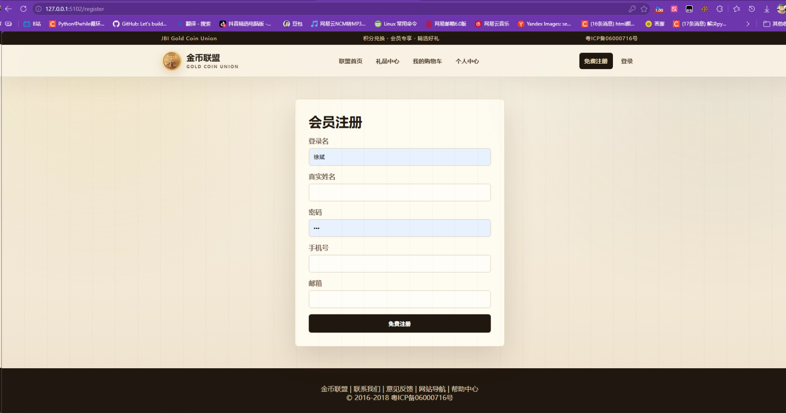

# BI 实训项目说明

本目录主要包含两个可运行的 Flask 项目：

1. `报表BI`
2. `金币联盟`

其中 `报表BI` 负责后台业务管理、数据仓库、ETL 和 BI 可视化报表；`金币联盟` 负责会员前台商城、会员注册登录、积金币和礼品兑换。两个项目共同围绕积分兑换平台业务库 `BIDemo_AccumulateCoin` 展开，`报表BI` 额外使用数据仓库 `BI_GoldCoin_DW` 做统计分析。

`商务智能实训` 目录为原始实训资料和参考材料，不作为本 README 的主要项目介绍范围。

## 一、项目结构

```text
BI/
├─ 报表BI/        后台管理 + 数据仓库 + ETL + BI 报表大屏
├─ 金币联盟/      会员前台商城复刻系统
└─ 商务智能实训/  原始实训资料与参考文件
```

## 二、报表BI

`报表BI` 是积分兑换平台的 BI 报表项目，使用 `Flask + SQL Server + ECharts` 实现。项目不只是展示图表，还包含业务数据维护、数据仓库 SQL、ETL 脚本、Dashboard 统计视图和可视化大屏。


### 主要功能

- 会员、商家、商品、礼品、积分码、订单、积分流水等后台数据页面。

- 积分获取和礼品兑换业务操作页面。

- 数据仓库 `BI_GoldCoin_DW` 建库脚本。

- ODS、维度表、事实表和 Dashboard 视图脚本。

- 全量 ETL 和增量 ETL 脚本。

- ECharts 单页 BI 仪表盘。

- BI API 接口，为前端图表提供数据。

  

- 商家管理

- 

  

- 会员管理

- 

  

- 礼品管理

- 
### 分析主题

项目覆盖以下 BI 分析主题：

| 主题 | 说明 |
|---|---|
| 商家统计分析 | 查看商家数量、商品数量和商家贡献 |
| 会员统计分析 | 查看会员规模、会员增长和地域分布 |
| 礼品统计分析 | 查看礼品库存、兑换次数和兑换金币 |
| 订单统计分析 | 查看订单趋势、订单积分和订单状态 |
| 商家会员统计分析 | 查看商家带来的会员和积分贡献 |
| 商品积分统计分析 | 查看商品积分码和积分贡献 |
| 积分码使用统计分析 | 查看积分码待使用、已使用和无效状态 |
| 积分流水统计分析 | 查看金币收入、金币支出和账户交易 |
| 地域统计分析 | 查看不同地区会员和订单分布 |

### 技术方案

| 类型 | 内容 |
|---|---|
| Web 框架 | Flask |
| 页面模板 | Jinja2 |
| 图表 | ECharts |
| 数据库 | SQL Server |
| 业务库 | `BIDemo_AccumulateCoin` |
| 数据仓库 | `BI_GoldCoin_DW` |
| 数据库连接 | pyodbc |

### 运行方式

```powershell
cd C:\Users\PXHONY\Desktop\BI\报表BI
pip install -r requirements.txt
python app.py
```

如果使用本机 Python 3.10 路径：

```powershell
& 'C:\Users\PXHONY\AppData\Local\Programs\Python\Python310\python.exe' app.py
```

启动后访问：

```text
http://127.0.0.1:5101
```

### 数据仓库初始化

数据仓库脚本位于：

```text
报表BI/sql/dw/
```

首次初始化建议按顺序执行：

```powershell
sqlcmd -S . -E -C -i sql\dw\01_create_dw_database.sql
sqlcmd -S . -E -C -d BI_GoldCoin_DW -i sql\dw\02_create_ods_tables.sql
sqlcmd -S . -E -C -d BI_GoldCoin_DW -i sql\dw\03_create_dim_tables.sql
sqlcmd -S . -E -C -d BI_GoldCoin_DW -i sql\dw\04_create_fact_tables.sql
sqlcmd -S . -E -C -d BI_GoldCoin_DW -i sql\dw\05_full_etl.sql
sqlcmd -S . -E -C -d BI_GoldCoin_DW -i sql\dw\07_dashboard_views.sql
```

后续同步新增业务数据：

```powershell
sqlcmd -S . -E -C -d BI_GoldCoin_DW -i sql\dw\06_incremental_etl.sql
```

## 三、金币联盟

`金币联盟` 是会员前台商城复刻系统，基于原 ASP.NET Web Forms 版本的金币联盟页面和图片素材，使用 `Flask + HTML + CSS + SQL Server` 重新实现。它面向会员使用，负责注册、登录、积金币、查看礼品、兑换礼品和个人中心。

这个项目和 `报表BI` 共用业务库 `BIDemo_AccumulateCoin`。会员在金币联盟中产生的注册、积分码使用、礼品兑换、订单和积分流水数据，后续都可以被 `报表BI` 抽取到数据仓库中做统计分析。

- 金币联盟
- 

- 金币首页
- 

- 注册账号
- 


### 主要功能

- 金币联盟首页展示。
- 原金币联盟 Logo、横幅、商品图片和频道图片素材复用。
- 会员注册。
- 会员登录和退出。
- 输入积分码获取金币。
- 礼品中心展示。
- 购物车兑换礼品。
- 个人中心查看会员信息、订单和积分流水。

### 页面路由

| 路由 | 功能 |
|---|---|
| `/` | 金币联盟首页 |
| `/login` | 会员登录 |
| `/register` | 会员注册 |
| `/earn-coin` | 输入积分码获取金币 |
| `/gifts` | 礼品中心 |
| `/cart` | 购物车兑换 |
| `/profile` | 个人中心 |
| `/profile/complete` | 完善个人信息 |
| `/profile/edit` | 修改个人信息 |
| `/logout` | 退出登录 |

### 技术方案

| 类型 | 内容 |
|---|---|
| Web 框架 | Flask |
| 页面模板 | Jinja2 |
| 样式 | CSS |
| 交互 | 原生 JavaScript |
| 数据库 | SQL Server |
| 业务库 | `BIDemo_AccumulateCoin` |
| 数据库连接 | pyodbc |

### 运行方式

```powershell
../BI/金币联盟
pip install -r requirements.txt
python app.py
```

如果使用本机 Python 3.10 路径：

```powershell
& 'C:\Users\PXHONY\AppData\Local\Programs\Python\Python310\python.exe' app.py
```

启动后访问：

```text
http://127.0.0.1:5102
```

## 四、两个项目的关系

```text
金币联盟
  会员注册、登录、积金币、兑换礼品
        ↓
BIDemo_AccumulateCoin 业务库
        ↓
报表BI ETL
        ↓
BI_GoldCoin_DW 数据仓库
        ↓
报表BI 大屏展示
```

`金币联盟` 更偏会员前台操作，负责产生真实业务数据；`报表BI` 更偏后台管理和分析展示，负责整理业务数据、建设数据仓库并输出可视化报表。两个项目组合后，可以形成从会员使用、业务数据沉淀、数据仓库建模到 BI 报表分析的完整闭环。

## 五、环境要求

| 环境 | 说明 |
|---|---|
| Python | 建议 Python 3.10 |
| 数据库 | SQL Server |
| 数据库驱动 | ODBC Driver 18 for SQL Server |
| Python 依赖 | Flask、pyodbc |
| 认证方式 | Windows 身份验证 |

SQL Server 本机连接默认使用：

```text
SERVER=.
Trusted_Connection=yes
TrustServerCertificate=yes
```

## 六、建议启动顺序

1. 确认 SQL Server 可连接。
2. 初始化对应的数据库 `BIDemo_AccumulateCoin` 已存在。
3. 在 `报表BI` 中执行数据仓库 SQL 和 ETL。
4. 启动 `报表BI`，访问 `http://127.0.0.1:5101` 查看 BI 大屏。
5. 启动 `金币联盟`，访问 `http://127.0.0.1:5102` 测试会员前台流程。
6. 使用金币联盟产生新业务数据后，可回到 `报表BI` 执行增量 ETL 并刷新报表。

