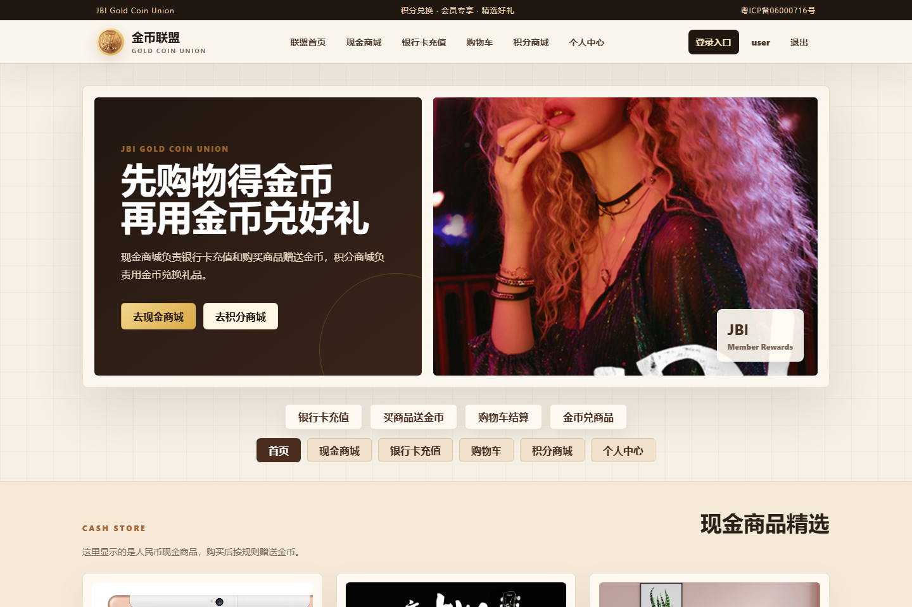
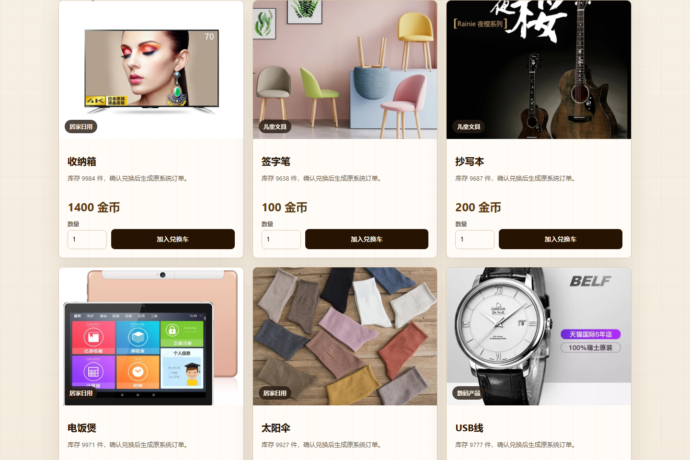
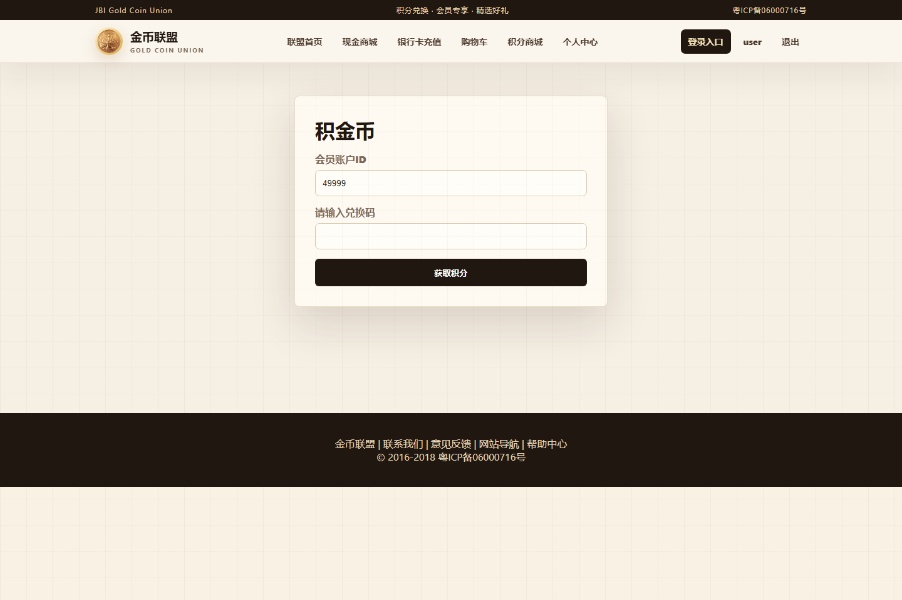
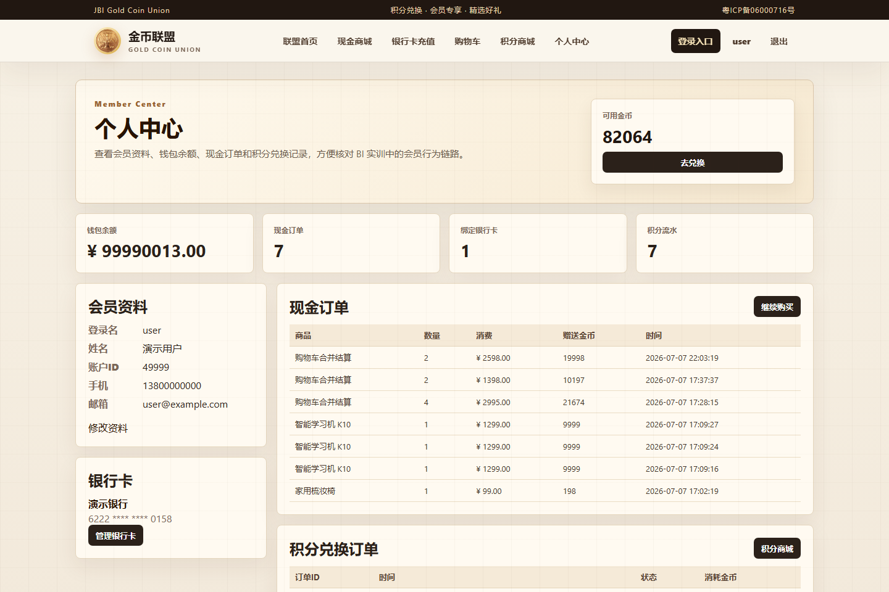
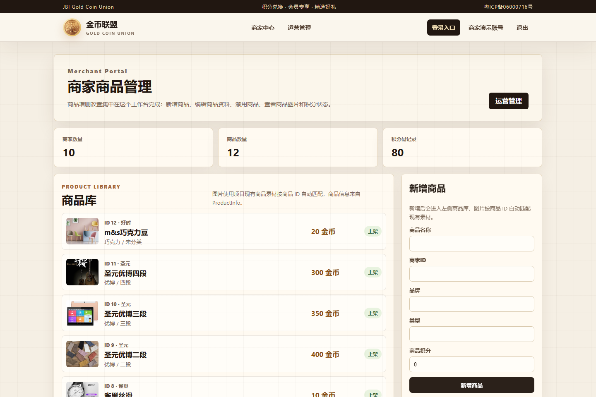

# 金币联盟复刻项目说明文档

这个项目是我在商务智能实训中单独整理出来的“金币联盟商城复刻系统”。它不是重新做一个完全无关的商城，而是在原来 ASP.NET Web Forms 版本的金币联盟页面基础上，保留原来的页面识别、图片素材和业务流程，再用 `Flask + HTML + CSS + SQL Server` 重新实现一版可以运行的会员兑换商城。

我做这个项目的目的主要是把前面的积分平台业务数据真正用起来。积分平台偏后台管理，BI 项目偏报表分析，而金币联盟就是面向会员的前台商城。会员可以注册、登录、绑定银行卡充值、用现金购买商品获得金币，也可以进入积分商城用金币兑换礼品，最后这些业务数据还能进入后续 BI 报表分析。

## 一、项目定位

金币联盟项目主要承担“会员前台商城”的作用，重点是让用户能通过比较直观的页面完成积分相关操作。

我给这个项目定的目标是：

1. 复刻原金币联盟界面的主要视觉元素。
2. 保留原项目中的商品图片、频道图片、Logo 和横幅素材。
3. 使用 Flask 替代原 ASP.NET Web Forms 实现页面路由。
4. 连接 `BIDemo_AccumulateCoin` 数据库，真实操作会员、账户、积分码、礼品和订单数据。
5. 实现会员注册、会员登录、银行卡充值、现金购买赠金币、积分商城兑换、个人中心等功能。
6. 让这个前台项目和积分平台、BI 报表形成完整闭环。

简单来说，这个项目更像是“业务系统前台”，不是单独的静态页面。

## 二、原系统分析

在开始做之前，我先看了原来的金币联盟 ASP.NET 项目。原项目路径是：

```text
C:\Users\PXHONY\Desktop\BI\商务智能实训\金币联盟界面\金币联盟
```

原项目主要页面包括：

| 原 ASP.NET 页面 | 当前 Flask 路由 | 作用 |
|---|---|---|
| `首页.aspx` | `/mall` | 用户登录后的金币联盟首页，展示横幅、商品九宫格和频道区 |
| `会员登录.aspx` | `/login` | 会员登录 |
| `会员注册.aspx` | `/register` | 会员注册 |
| `积金币.aspx` | `/earn-coin` | 输入积分码获取金币 |
| `购物车.aspx` | `/cart` | 选择礼品并兑换 |
| `个人信息.aspx` | `/profile` | 查看会员信息、订单和积分明细 |
| `完善个人信息.aspx` | `/profile/complete` | 完善资料页面 |
| `修改个人信息.aspx` | `/profile/edit` | 修改资料页面 |

原来的 ASP.NET 页面有一些按钮和控件逻辑没有完全写完整，所以我没有直接照搬代码，而是先提取它的页面结构和业务意图，再用 Flask 重新组织。

## 三、视觉复刻思路

原金币联盟页面的特点比较明显：顶部是棕色导航，整体有紫色背景氛围，中间是黄色金币商品区，还有 `JBI.jpg` Logo、`ZS.png` 大横幅、九宫格商品图和频道区图片。

所以我在设计时保留了这些识别点：

| 视觉元素 | 当前实现 |
|---|---|
| 顶部导航 | `base.html` 中实现联盟首页、礼品中心、购物车、个人中心 |
| Logo | 使用原素材 `JBI.jpg` |
| 首页横幅 | 使用原素材 `ZS.png` |
| 商品九宫格 | 使用 `1.jpg` 到 `9.jpg` |
| 频道区 | 使用 `A.jpg` 到 `J.jpg` |
| 金币主题 | 使用黄色、棕色、紫色作为主色 |
| 页面风格 | 保留原商城感觉，同时改成更整齐的响应式布局 |

我没有把页面做成普通后台风格，因为金币联盟本身是会员商城。这里重点是“商品”和“兑换”的感觉，所以首页保留了比较强的商品展示区。

## 四、素材整理

原项目素材已经整理到当前项目：

```text
static/assets/
```

主要素材包括：

| 素材 | 用途 |
|---|---|
| `JBI.jpg` | 顶部 Logo |
| `ZS.png` | 首页大横幅 |
| `1.jpg` - `9.jpg` | 首页金币好礼九宫格 |
| `A.jpg` - `J.jpg` | 底部频道区图片 |
| `333.jpg`、`timg.jpg` | 备用图片素材 |

这样做的好处是，项目运行时不再依赖原 ASP.NET 目录，Flask 项目本身就包含了完整页面资源。

## 五、前端体验优化

会员侧核心交易页面已经统一做成更清晰的商城产品界面：

| 页面 | 优化内容 |
|---|---|
| `/wallet` | 使用余额卡、状态指标、两步表单和交易台账展示银行卡充值流程 |
| `/shop` | 使用商品卡片、购物车状态条和现金购买记录展示现金商城 |
| `/points-mall` | 使用礼品卡片、兑换车状态条和 AddOrder 写入提示展示积分商城 |
| `/cart` | 将现金商品和积分礼品拆成两个独立结算区，分别显示数量、金额、金币和确认按钮 |

交互上，现金商品加入购物车后跳转到 `/cart#cash-cart`，积分礼品加入兑换车后跳转到 `/cart#points-cart`。这样用户提交后可以直接看到结果，避免停留在商品列表造成“加入购物车没有反应”的体验问题。

## 六、业务流程设计

金币联盟项目的核心流程主要有四条。

### 6.1 会员注册和登录

会员注册时会写入 `CustomerInfo` 表，同时创建会员积分账户，账户信息写入 `Account` 表。

流程是：

```text
填写注册信息
        ↓
写入 CustomerInfo
        ↓
创建 Account 会员账户
        ↓
跳转到登录页面
```

登录时会校验 `CustomerInfo` 中的用户名和密码，登录成功后把 `CustomerID`、`AccountID` 和 `LoginName` 写入 session，后续积金币和兑换时就可以直接使用当前会员信息。

### 6.2 输入积分码获取金币

会员在 `/earn-coin` 页面输入积分码以后，系统调用业务库里的 `CoinTrade` 存储过程完成积分获取。

流程是：

```text
会员输入积分码
        ↓
读取当前 AccountID
        ↓
调用 CoinTrade
        ↓
校验积分码状态
        ↓
写入积分流水
        ↓
更新会员金币余额
```

这里没有自己重新写一套积分计算逻辑，而是复用原业务库的存储过程，这样能保证和积分平台后台的数据规则一致。

### 6.3 银行卡充值和现金购物赠金币

会员在 `/wallet` 页面绑定银行卡并充值到项目钱包，随后进入 `/shop` 现金商城选择商品并加入购物车。用户在 `/cart#cash-cart` 统一确认结算后，现金订单会记录到本地 JSON 文件，同时系统会把商品配置中的赠送金币发放到会员账户。

流程是：

```text
绑定银行卡
        ↓
充值到会员钱包
        ↓
进入现金商城加入购物车
        ↓
进入购物车确认结算
        ↓
扣减钱包余额
        ↓
记录现金订单
        ↓
发放赠送金币到 Account.ValidCoin
```

银行卡、充值和现金订单演示数据保存到：

```text
docs/customer_wallets.json
```

### 6.4 积分商城兑换

礼品数据来自 `GiftInfo` 表，页面会展示可兑换礼品、所需金币和库存。用户进入 `/points-mall` 后先把礼品加入兑换车，再到 `/cart#points-cart` 确认兑换。确认时系统调用 `AddOrder` 存储过程生成订单并扣减金币。

流程是：

```text
查看积分商城
        ↓
选择礼品和数量并加入兑换车
        ↓
进入购物车确认兑换
        ↓
调用 AddOrder
        ↓
生成 OrderInfo 和 OrderGift
        ↓
扣减会员金币并记录流水
```

这个流程和后面的 BI 报表也有关，因为订单、礼品兑换和积分流水都会成为 BI 分析数据。

### 6.5 和报表BI的数据交互

金币联盟的业务操作会直接写入 `BIDemo_AccumulateCoin`，报表BI 的 ETL 会从该业务库抽取数据到 `BI_GoldCoin_DW`。因此金币联盟不是单独的演示页面，而是 BI 报表的数据来源之一。

| 金币联盟操作 | 影响的业务表 | 报表BI 展示位置 |
|---|---|---|
| 会员注册 | `CustomerInfo`、`Account` | 会员 KPI、会员趋势、地域分析 |
| 商家注册 | `BusinessMen`、商家账户 | 商家 KPI、商家会员贡献 |
| 新增商品 | `ProductInfo` | 商品积分贡献排行 |
| 上传积分码 | `JFCode` | 积分码状态环图、商品积分码统计 |
| 输入积分码积金币 | `JFCode`、`AccountTradeLog`、`Account` | 金币收入、积分流水、商品贡献 |
| 现金购买赠金币 | `Account`、`docs/customer_wallets.json` | 会员金币余额变化，可作为现金订单扩展数据 |
| 兑换礼品 | `OrderInfo`、`OrderGift`、`GiftInfo`、`AccountTradeLog` | 订单趋势、礼品排行、金币支出 |
| 取消/完成订单 | `OrderInfo`、账户和库存相关数据 | 订单状态、订单数量和兑换积分变化 |

操作完成后，需要在 `报表BI` 中执行增量 ETL：

```powershell
cd C:\Users\PXHONY\Desktop\BI\报表BI
sqlcmd -S . -E -C -d BI_GoldCoin_DW -i sql\dw\06_incremental_etl.sql
```

然后刷新 `http://127.0.0.1:5101`，即可在 BI 大屏查看金币联盟产生的新数据。

## 七、功能模块

当前项目实现的页面和功能如下：

| 模块 | 路由 | 功能说明 |
|---|---|---|
| 登录注册入口 | `/` | 精美登录注册页，默认用户登录，也支持商家登录和商家注册 |
| 用户商城首页 | `/mall` | 用户登录后展示横幅、商品九宫格、频道区和部分礼品数据 |
| 会员登录 | `/login` | 会员输入账号密码登录 |
| 会员注册 | `/register` | 新会员注册并创建积分账户 |
| 积金币 | `/earn-coin` | 输入积分码获取金币 |
| 银行卡充值 | `/wallet` | 绑定银行卡、充值钱包、查看充值记录 |
| 现金商城 | `/shop` | 浏览现金商品并加入购物车，提交后跳转到 `/cart#cash-cart` |
| 现金购物车 | `/cart#cash-cart` | 统一结算现金商品，支持修改数量，扣减钱包余额并赠送金币 |
| 积分商城 | `/points-mall` | 从数据库加载平台礼品，先加入兑换车，提交后跳转到 `/cart#points-cart` |
| 积分兑换车 | `/cart#points-cart` | 支持修改兑换数量，由用户最后确认兑换，调用 `AddOrder` 写入原订单数据库 |
| 个人中心 | `/profile` | 账户概览页，查看会员资料、钱包余额、银行卡、现金订单、兑换订单和积分明细 |
| 商家中心 | `/merchant` | 商品图片化管理工作台，支持商品新增、查询、编辑、禁用/删除、积分码上传和批量生成 |
| 运营管理 | `/admin-lite` | 覆盖商家、商品、礼品、积分码、订单取消和订单完成等实训功能 |
| 完善资料 | `/profile/complete` | 保留原页面结构 |
| 修改资料 | `/profile/edit` | 保留原页面结构 |
| 退出登录 | `/logout` | 清空 session 并返回首页 |

### 核心功能和页面截图

下面按实际演示顺序说明系统核心功能，并配套当前系统页面截图。

#### 1. 统一登录和角色入口

系统入口页把用户登录、用户注册、商家登录和商家注册集中在同一个页面。默认提供演示用户 `user / 123456` 和演示商家 `merchant / 123456`，便于快速进入会员端或商家端。


#### 2. 会员商城首页

会员登录后进入金币联盟首页，页面保留原金币联盟的 Logo、横幅、商品九宫格和频道图片素材，用来展示前台商城的整体视觉和业务入口。



#### 3. 钱包、银行卡和充值

会员可以在钱包页绑定银行卡、向项目钱包充值，并查看余额、银行卡数量、待结算商品、购物车金额和预计赠送金币。这个页面支撑后续现金购物赠金币流程。


#### 4. 现金商城和加入购物车

现金商城展示可购买商品、商品价格和购买后赠送金币。会员选择数量后加入购物车，系统会跳转到 `/cart#cash-cart`，让用户立即看到待结算商品。


#### 5. 统一购物车结算

购物车页拆成两个区域：现金商品结算区和积分礼品兑换区。现金商品结算会扣减钱包余额并发放赠送金币；积分礼品兑换会调用 `AddOrder`，写入原业务库订单和订单礼品明细。


#### 6. 积分商城兑换

积分商城从 `GiftInfo` 表读取可兑换礼品、库存和所需金币。会员先把礼品加入兑换车，再到购物车确认兑换，避免直接点击后看不到反馈。



#### 7. 输入积分码获取金币

积金币页面用于输入积分码。系统调用原业务库 `CoinTrade` 存储过程，检查积分码有效性，修改积分码状态，并把金币变化写入积分流水。



#### 8. 个人中心

个人中心汇总会员资料、金币账户、钱包余额、银行卡、现金订单、兑换订单和积分流水，便于演示用户侧业务数据如何沉淀到系统中。



#### 9. 商家中心

商家中心面向商家角色，支持商品图片化管理、商品新增、查询、编辑、禁用/删除、商品积分调整，以及积分码单个上传和批量生成。



#### 10. 运营管理

运营管理页覆盖实训要求中的后台操作，包括商家、商品、礼品、积分码、订单取消和订单完成等功能。它和商家中心共同补齐原系统后台业务能力。


#### 11. 业务数据和 BI 闭环

金币联盟产生的会员、商家、商品、积分码、现金购物、礼品兑换、订单和积分流水数据都会沉淀到 `BIDemo_AccumulateCoin` 或本地演示数据文件。报表BI 项目再通过 ETL 把业务数据抽取到 `BI_GoldCoin_DW`，最终在 BI 大屏中展示会员、商家、订单、礼品、积分码和金币流水等分析结果。

```text
金币联盟业务操作
        ↓
BIDemo_AccumulateCoin 业务库
        ↓
报表BI 执行 ETL
        ↓
BI_GoldCoin_DW 数据仓库
        ↓
ECharts BI 大屏分析
```

## 八、与实训项目说明文档的功能对照

项目已按 `C:\Users\PXHONY\Desktop\chen\data\《商务智能》实训项目说明文档.docx` 中的功能要求补齐到 `金币联盟`：

| Word 要求 | 当前实现位置 | 实现说明 |
|---|---|---|
| 会员注册 | `/`、`/register` | 检查会员登录名唯一，新增会员并创建会员积分账户 |
| 商家注册 | `/`、`/merchant`、`/admin-lite` | 检查商家中文名唯一，收集联系人、电话、邮箱、地址、经营类目、执照号等资料，新增商家并创建商家积分账户 |
| 新增商家商品参与积分 | `/merchant`、`/admin-lite` | 检查商家有效，新增商品并设置商品积分，商家页会自动匹配商品图片展示 |
| 新增平台礼品参与兑换 | `/admin-lite` | 检查礼品名称唯一，新增礼品、金币和库存 |
| 会员积分 | `/earn-coin` | 调用 `CoinTrade`，检查积分码有效性、修改状态并写入积分流水 |
| 会员兑换 | `/points-mall`、`/cart` | 调用 `AddOrder`，检查会员积分、礼品状态和库存，写入订单和订单礼品表 |
| 积分码上传脚本 | `/merchant`、`/admin-lite` | 支持单个积分码上传和批量积分码生成，并写入 MD5 密文码 |
| 禁用商家 | `/admin-lite` | 禁用前检查是否仍有可积分商品 |
| 禁用商家商品 | `/merchant`、`/admin-lite` | 将商品状态置为禁用，保留历史数据用于 BI 追溯 |
| 商家商品编辑 | `/merchant`、`/admin-lite` | 按商品 ID 修改商品名称、品牌、类型、积分和状态 |
| 商家商品积分调整 | `/merchant`、`/admin-lite` | 更新商品积分 `ProductCoin` |
| 禁用平台礼品 | `/admin-lite` | 将礼品状态置为禁用 |
| 取消兑换 | `/admin-lite` | 将订单置为客户取消，并回补会员金币和礼品库存 |
| 订单状态 | `/admin-lite`、`/profile` | 支持查看订单状态，并可将订单设置为完成 |

## 九、数据库设计关系

这个项目没有新建单独数据库，而是直接连接实训业务库：

```text
BIDemo_AccumulateCoin
```

主要用到的表和存储过程如下：

| 数据库对象 | 作用 |
|---|---|
| `CustomerInfo` | 会员信息 |
| `Account` | 会员积分账户 |
| `GiftInfo` | 礼品信息和库存 |
| `JFCode` | 积分码 |
| `OrderInfo` | 订单主表 |
| `OrderGift` | 订单礼品明细 |
| `AccountTradeLog` | 积分交易流水 |
| `CoinTrade` | 积分获取和积分交易 |
| `AddOrder` | 礼品兑换下单 |

我这样设计是为了让金币联盟不是静态展示页面，而是能真正写入业务库。后续 BI 项目抽取数据时，也可以把这里产生的数据纳入统计分析。

## 十、项目技术方案

| 层级 | 技术 |
|---|---|
| Web 框架 | Flask |
| 页面模板 | Jinja2 |
| 样式 | CSS，已针对商城、钱包、购物车、积分商城、个人中心和商家中心做统一产品页排版 |
| 交互 | 原生 JavaScript |
| 数据库 | SQL Server |
| 数据库连接 | pyodbc |
| 业务库 | `BIDemo_AccumulateCoin` |

我没有引入 Vue、React 这类前端框架，因为这个系统页面数量不多，使用 Flask 模板已经足够，也更符合实训项目简单部署的要求。

## 十一、目录结构

```text
金币联盟/
├─ app.py                    Flask 路由入口
├─ config.py                 SQL Server 连接配置
├─ requirements.txt          Python 依赖
├─ DESIGN.md                 前端设计规范
├─ README.md                 当前项目说明文档
├─ db/
│  └─ sqlserver.py           pyodbc 数据库访问封装
├─ services/
│  └─ mall_service.py        商城业务逻辑，包括登录、注册、充值、现金购物、积金币、礼品兑换、个人中心
├─ templates/
│  ├─ base.html              公共布局，顶部导航和页脚
│  ├─ auth.html              登录注册入口，支持用户和商家模式切换
│  ├─ index.html             用户商城首页
│  ├─ login.html             登录页
│  ├─ register.html          注册页
│  ├─ earn_coin.html         积金币页
│  ├─ wallet.html            银行卡绑定和钱包充值页
│  ├─ shop.html              现金商城页
│  ├─ points_mall.html       积分商城页
│  ├─ cart.html              现金商品购物车和积分礼品兑换车
│  ├─ profile.html           个人中心
│  ├─ profile_form.html      完善/修改个人信息
│  ├─ merchant.html          商家中心
│  └─ admin_lite.html        运营管理页
├─ static/
│  ├─ assets/                原金币联盟图片素材
│  ├─ css/mall.css           商城样式
│  └─ js/mall.js             简单交互脚本
├─ docs/
│  ├─ customer_wallets.json  会员钱包、银行卡和现金订单演示数据
│  ├─ merchant_profiles.json 商家扩展资料演示数据
│  └─ screenshots/           页面截图目录
└─ tests/
   ├─ test_cart_quantity.py  购物车数量和钱包汇总测试
   └─ test_cart_routes.py    商城加入购物车跳转测试
```

## 十二、设计到制作的过程

我实际制作这个项目时，大概是按下面步骤来的：

```text
第一步：读取原 ASP.NET 金币联盟项目
        ↓
第二步：整理原页面、按钮、图片和业务入口
        ↓
第三步：把原页面映射成 Flask 路由
        ↓
第四步：复制并整理原项目图片素材
        ↓
第五步：编写 DESIGN.md，确定复刻风格
        ↓
第六步：实现公共布局 base.html
        ↓
第七步：实现首页、登录、注册、积金币、购物车、个人中心页面
        ↓
第八步：编写 mall_service.py 连接业务库
        ↓
第九步：调用 CoinTrade 和 AddOrder 存储过程
        ↓
第十步：整理 README 和运行说明
```

这个顺序对我来说比较清晰，因为如果先写页面，很容易漏掉原系统的功能；如果先写数据库逻辑，又容易忽略复刻效果。所以我是先看原系统，再拆页面，再接业务数据。

## 十三、运行方式

先进入项目目录：

```powershell
cd C:\Users\PXHONY\Desktop\BI\金币联盟
```

安装依赖：

```powershell
pip install -r requirements.txt
```

启动项目：

```powershell
python app.py
```

如果使用我本机 Python 路径，也可以这样启动：

```powershell
& 'C:\Users\PXHONY\AppData\Local\Programs\Python\Python310\python.exe' app.py
```

启动后访问：

```text
http://127.0.0.1:5102
```

打开后首先进入登录注册入口。默认是用户登录：

| 角色 | 账号 | 密码 | 登录后进入 |
|---|---|---|---|
| 用户 | `user` | `123456` | `/mall` 用户端金币联盟 |
| 商家 | `merchant` | `123456` | `/merchant` 商家中心 |

用户也可以直接在入口页注册新会员。商家点击“商家登录”后可以切换到“商家注册”，注册内容包括商家名称、登录账号、密码、经营类目、联系人、联系电话、邮箱、营业执照号、商家地址和备注。商家基础信息会写入 `BusinessMen` 和商家积分账户，扩展资料保存到：

```text
docs/merchant_profiles.json
```

### 13.1 使用启停脚本

项目根目录已经提供 Windows 启停脚本，双击或在 PowerShell / CMD 中执行都可以。`start.bat` 会打开可见控制台窗口，显示访问地址和 Flask 运行日志。

启动项目：

```powershell
.\start.bat
```

停止项目并释放 `5102` 端口：

```powershell
.\stop.bat
```

重启项目：

```powershell
.\restart.bat
```

脚本默认使用：

```text
C:\Users\PXHONY\AppData\Local\Programs\Python\Python310\python.exe
```

如果该 Python 路径不存在，会自动回退为系统 `python` 命令。`start.bat` 是前台启动方式，窗口中会直接显示 Flask 运行日志；需要停止时可以关闭该窗口，或另开终端执行 `stop.bat`。

脚本为单文件 `.bat`，可以直接双击使用，不需要额外的 `.ps1` 文件。

## 十四、配置说明

数据库连接配置在 `config.py` 中：

```text
SQLSERVER_SERVER = .
SQLSERVER_DATABASE = BIDemo_AccumulateCoin
SQLSERVER_DRIVER = ODBC Driver 18 for SQL Server
```

默认使用 Windows 身份验证，并设置了 `TrustServerCertificate=yes`，这样本机 SQL Server 使用 ODBC Driver 18 时不会因为证书校验失败导致连接不上。

## 十五、当前完成情况

目前这个金币联盟项目已经完成：

1. Flask 项目结构。
2. 原金币联盟图片素材迁移。
3. 首页商品九宫格和频道区展示。
4. 顶部导航和登录状态显示。
5. 会员注册。
6. 会员登录和退出。
7. 银行卡绑定和钱包充值。
8. 现金商城购买商品并赠送金币。
9. 积金币功能，调用 `CoinTrade`。
10. 积分商城展示。
11. 礼品兑换，调用 `AddOrder`。
12. 个人中心展示会员信息、订单和积分流水。
13. 商家中心，支持商品图片化列表、商品新增、查询、编辑、禁用/删除、商品积分调整、积分码上传和批量生成。
14. 运营管理，支持商家/商品/礼品禁用、订单取消、订单完成。
15. `/wallet`、`/shop`、`/points-mall` 和 `/cart` 会员侧核心交易页重做，减少原页面拥挤感。
16. 现金商品加入购物车后跳转 `/cart#cash-cart`，积分礼品加入兑换车后跳转 `/cart#points-cart`。
17. 钱包汇总增加现金购物车件数、购物车金额、预计赠送金币、积分兑换车件数和预计消耗金币。
18. 响应式商城样式。
19. 前端设计规范 `DESIGN.md`。
20. 购物车数量、钱包汇总和商城加入购物车跳转自动化测试。

## 十六、和其他项目的关系

这个项目不是孤立的，它和另外两个项目是连在一起的：

| 项目 | 关系 |
|---|---|
| 积分平台 | 偏后台管理，负责维护会员、商家、商品、礼品、积分码等基础数据 |
| 金币联盟 | 偏会员前台，负责会员登录、银行卡充值、现金购物赠金币和积分商城兑换 |
| 报表BI | 偏统计分析，从业务库抽取数据到数仓，再展示 BI 大屏 |

所以金币联盟产生的注册、商家、商品、积分码、订单和兑换数据，后续都可以进入 BI 报表里分析。实训演示时可以先在金币联盟新增数据，再执行报表BI的增量 ETL，最后刷新 BI 大屏观察统计变化，这样能体现“业务系统产生数据，数据仓库整理数据，报表系统展示数据”的完整流程。

## 十七、我的总结

这个项目最重要的地方不是页面好不好看，而是它把原来的金币联盟业务重新跑通了。原 ASP.NET 项目里有页面和素材，但是实现不完整；我这里保留它的视觉识别和业务入口，再用 Flask 重新实现，让它可以连接当前的 SQL Server 业务库。

从实训角度看，这个项目补上了“会员前台操作”这一环。后台积分平台负责数据维护，金币联盟负责会员实际使用，BI 项目负责最后统计分析。这样整个积分兑换平台就不是单独几个页面，而是形成了比较完整的业务闭环。
